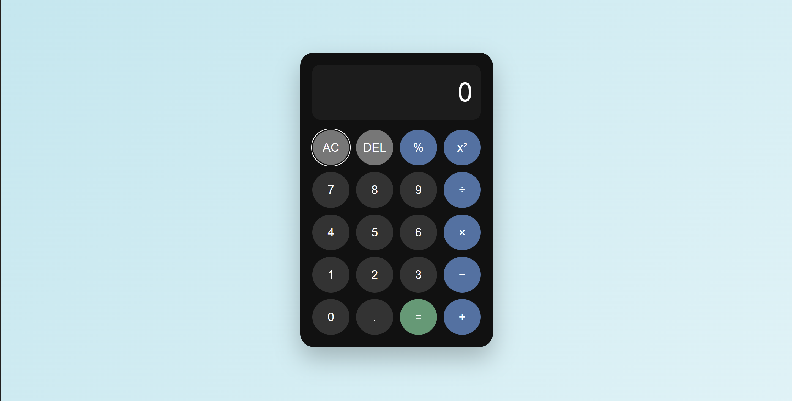

# 🧮 Calculator

A responsive calculator web application built using **HTML, CSS, and Vanilla JavaScript**.

This project was developed as part of my web development internship to practice frontend development, JavaScript event handling, UI design, and application logic.

## ✨ Features

- Basic arithmetic operations
- Addition, subtraction, multiplication, and division
- Modulus (`%`) operation
- Square (`x²`) functionality
- Decimal calculations
- Clear (`AC`) functionality
- Delete (`DEL`) functionality
- Division-by-zero handling
- Invalid-expression handling
- Keyboard support
- Responsive design
- Interactive button states
- Expression evaluation without JavaScript `eval()`

## 🛠️ Technologies Used

- **HTML5** — Structure and semantic markup
- **CSS3** — Styling, layout, responsive design, and animations
- **JavaScript** — Calculator logic, event handling, keyboard interaction, and expression evaluation

## 📂 Project Structure

```text
calculator/
│
├── index.html
├── calc.css
├── calc.js
├── README.md
│
└── assets/
    └── calculator.png
```

## 🚀 Getting Started

No installation or dependencies are required.

### 1. Clone the repository

```bash
git clone <your-repository-url>
```

### 2. Open the project

Navigate to the project directory:

```bash
cd calculator
```

### 3. Run the application

Open `index.html` in a web browser.

You can also use the Live Server extension in Visual Studio Code for local development.

## 🎮 Keyboard Controls

| Key | Action |
|---|---|
| `0-9` | Enter numbers |
| `+` | Addition |
| `-` | Subtraction |
| `*` | Multiplication |
| `/` | Division |
| `%` | Modulus |
| `.` | Decimal |
| `Enter` / `=` | Calculate |
| `Backspace` | Delete |
| `Escape` | Clear |

## 📸 Preview

Add a screenshot of the calculator here:

```text

```

## 🧠 What I Learned

Through this project, I practiced:

- Building a user interface with HTML and CSS
- CSS Grid for calculator button layouts
- JavaScript DOM manipulation
- JavaScript event listeners
- Handling user input
- Implementing arithmetic operations
- Keyboard event handling
- Input validation and error handling
- Writing reusable JavaScript functions
- Debugging frontend applications
- Building responsive layouts

## 🔮 Possible Improvements

Future improvements could include:

- Calculation history
- Scientific calculator functions
- Dark/light themes
- Parentheses and more advanced expressions
- Memory functions such as `M+`, `M-`, and `MR`
- Improved accessibility
- Progressive Web App support

## 👩‍💻 Author

**Mansi Karpe**

Cybersecurity student interested in software development, web security, and building practical applications.

---

⭐ If you found this project useful, consider giving the repository a star.
